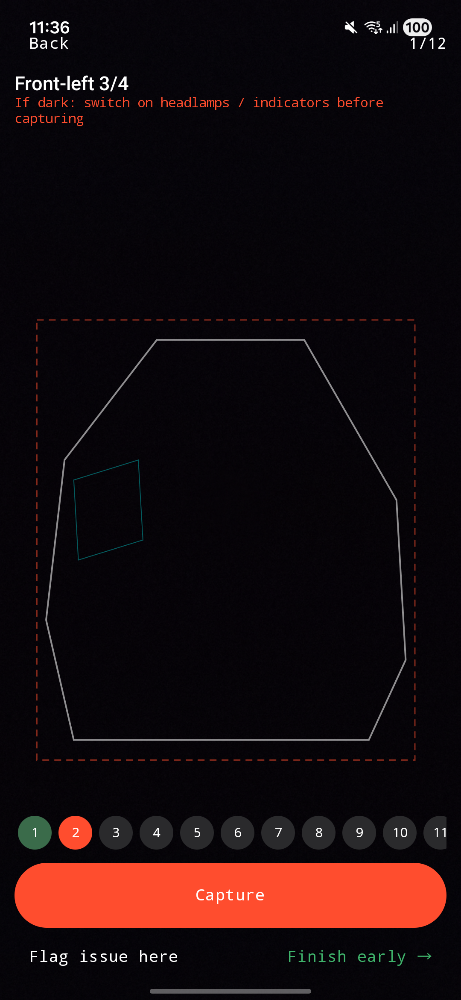
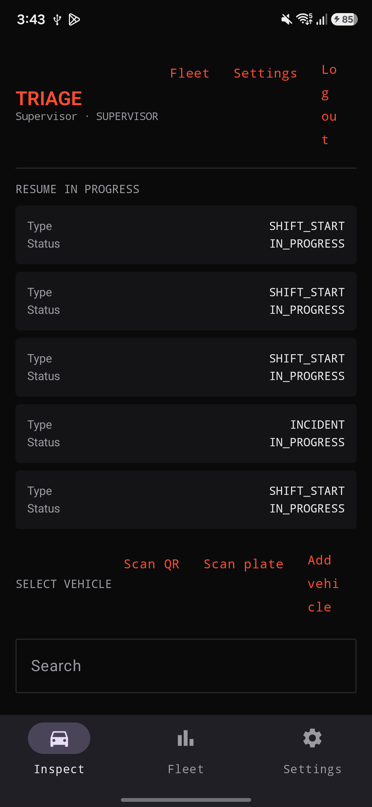
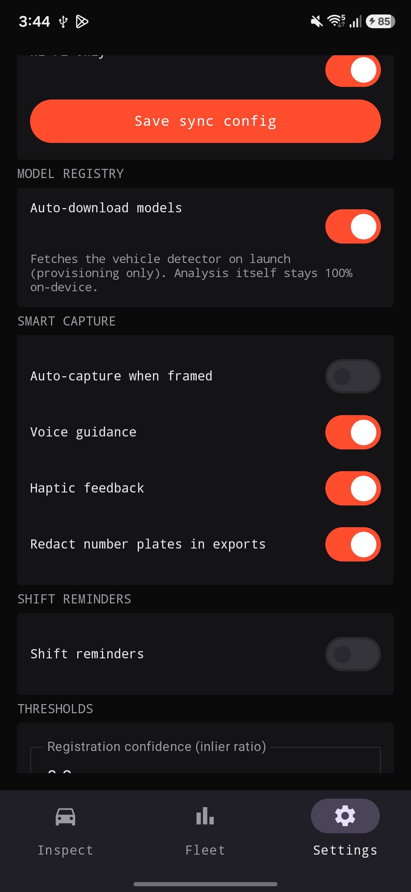

# TRIAGE

**Turn every driver's phone into a tamper-proof vehicle inspector. 100 percent on-device.**

EXPERIMENTAL APPLICATION

TRIAGE is a driver-side vehicle-inspection app for commercial EV fleets (Tata Tigor and Xpres-T
sedans). At shift start and shift end the driver runs a guided photo walkaround. The phone does all
the analysis on-device (exterior damage, tyres, lamps, interior and exterior cleanliness), then
diffs this walkaround against the previous accepted one for the same vehicle to surface NEW damage
and condition changes. The result is a timestamped, signed, hash-chained inspection record that
finally settles the question every fleet argues about: who scratched it.

No cloud vision. No external LLM. No network in the analysis path. A complete inspection works in
airplane mode.


---

## The problem it kills

Fleets bleed money on damage disputes. A car comes back scratched, nobody owns it, and there is no
trustworthy record of what the vehicle looked like at handover. Existing tools are either paper
checklists that prove nothing, or cloud apps that ship a driver's photos to someone else's server
and still cannot tell you what actually changed between two shifts.

TRIAGE fixes this with three ideas working together:

1. **Guided capture** that is consistent enough to compare across shifts.
2. **On-device analysis plus a diff engine** that tells you what is NEW versus what was already there.
3. **A per-vehicle hash chain** that makes the record tamper-evident, so the timeline holds up in a
   dispute.

---

## See it

| Guided capture | Driver home | Settings |
| :---: | :---: | :---: |
|  |  |  |

Matte near-black surfaces, monospace readouts, one earned accent color used only for NEW damage and
active states. The design language is called Operational Materialism. It is built to be read in a
parking lot at 6 in the morning.

---

## What it does

### Guided 12-station walkaround
A fixed sequence for a sedan with an on-screen ghost outline the driver aligns to: front, four
3-quarter angles, both sides, rear, two tyre closeups, and two interior shots. A live quality gate
rejects blurry, badly exposed, or mis-framed shots before they are accepted, with a specific reason
and an instant retake. Station geometry is config-driven JSON, so adding a new vehicle model is a
drop-in file, not a code change.

### Four analysis heads, every one on-device
Damage, tyre, lamp, and cleanliness. Each head has a fine-tuned model slot and a complete classical
computer-vision fallback written in pure Kotlin (Sobel and Laplacian edges, HSV statistics,
connected components, a minimal Hough circle, FAST corners, NCC descriptors, a RANSAC homography).
The app is honest about which engine produced each finding. The classical damage head is a change
detector, not a fake classifier, and it says so in the record.

### The diff engine, which is the whole point
For each station, the current photo is registered to the previous accepted photo using corner
matching and a RANSAC homography. Ghost-guided capture is what makes this tractable. Findings are
then matched zone by zone and labelled NEW, PRE-EXISTING, or RESOLVED. If registration confidence is
low, the app refuses to guess and asks a human to compare both photos side by side. It never
fabricates a verdict. NEW damage is shown with a responsible-shift attribution: this appeared
between inspection X by driver A and inspection Y by driver B.

### Tamper-evident records
Every photo is SHA-256 hashed at the moment of capture. Each finalized inspection chains the
previous record's hash for that vehicle, so the history forms a verifiable chain. Records are
immutable once signed. A one-tap verify re-hashes the stored photos and walks the chain, returning
VALID or BROKEN. Tamper with a single byte of any photo and it flips to BROKEN.

### Training-data exhaust
Every inspection is exportable as a ZIP of the original photos plus a findings.jsonl, a ready to
train labelled vehicle-damage dataset. Driver confirm and dispute actions become the human labels.

---

## Advanced features

- **Smart capture.** Live pre-shot camera analysis: a framing meter, a live vehicle bounding box,
  and a quality readout that react before you press the shutter, with directional guidance like step
  left or hold steady. Optional auto-capture when the frame holds ready. On-device voice guidance via
  text to speech. Haptics and a capture tone.
- **Auto-provisioned models.** A real COCO SSD-MobileNet vehicle detector downloads itself on first
  launch and powers the framing gate and the live box. Provisioning happens off the analysis path,
  so analysis stays fully offline. Fleet-specific damage and tyre models are drop-in upgrades through
  a documented model registry.
- **Number-plate OCR.** Scan a plate to identify the vehicle, fully on-device.
- **Review and evidence.** Pinch-zoom photo viewer, a before-and-after wipe slider for NEW damage, a
  damage heatmap overlay, a scannable verification QR of the record hash on the PDF, and automatic
  number-plate redaction in exports. Redaction touches export copies only. The stored originals and
  their hashes are never modified, so the chain stays intact.
- **Supervisor analytics.** A fleet KPI dashboard with a damage-rate chart and driver scorecards
  (inspections done, NEW damages introduced, average cleanliness, dispute rate), plus search,
  periodic background sync, and shift-start and shift-end reminders.
- **Access and polish.** Onboarding, bottom navigation, biometric fingerprint login with PIN as the
  fallback, a smooth bezier signature pad, and localization for English, Malayalam, and Hindi
  including voice.

---

## 100 percent on-device, stated plainly

All inference runs on the phone through LiteRT and classical CV. There are no external vision or LLM
APIs and no network calls in the analysis path. The only optional network feature is sync and export
of finalized records to a configurable endpoint, and it is cleanly separable and off by default.
You can produce a complete, signed, hash-chained inspection in airplane mode.

---

## Tech stack

- Kotlin, minSdk 26, Jetpack Compose, Coroutines and Flow
- CameraX for guided photo capture and live frame analysis
- LiteRT (com.google.ai.edge.litert) with a GPU to NNAPI to CPU delegate fallback per model
- Room for storage, DataStore for settings, WorkManager for optional sync and reminders
- ML Kit on-device barcode and text recognition, AndroidX Biometric, ZXing for QR generation
- Pure-Kotlin classical computer vision, no OpenCV, to keep the APK lean

---

## Architecture

```
cv/         pure-Kotlin classical CV: edges, HSV, histograms, connected components,
            Hough, FAST corners, NCC descriptors, RANSAC homography, specular
config/     capture points and station-config model plus loader
quality/    live capture quality gate
registry/   model registry manifest, auto-download, LiteRT interpreter factory, model handle
heads/      analysis head interface, orchestrator, and damage, tyre, lamp, clean heads
diff/       registration, finding-level matcher, diff engine with confidence gate and attribution
integrity/  SHA-256 hashing, canonical manifest, per-vehicle hash chain, signature and QR
data/       Room entities, DAOs, repositories, file store
inspection/ inspection lifecycle service, shift-type suggester, location stamp
vehicle/    vehicle and baseline services, ledger and league analytics, QR and plate OCR
analytics/  fleet metrics and driver scorecards
export/     dataset ZIP and findings.jsonl, local PDF, plate redaction
sync/       optional default-off WorkManager sync, the only network feature
ui/         Compose theme, navigation, screens, charts, components
```

---

## Getting started

You need Android Studio (latest stable) and a device or emulator on API 26 or higher.

```bash
git clone https://github.com/Sherin-SEF-AI/triage-android.git
cd triage-android
./gradlew assembleDebug      # or open the project in Android Studio and press Run
```

Install on an arm64 device:

```bash
./gradlew installDebug
```

On first launch the app seeds a default supervisor account named Supervisor with PIN 1234. Change it
in Settings. Drivers self-register on the login screen. To verify the full loop, enable airplane
mode, run a walkaround, sign, and finalize. Then run a second walkaround of the same vehicle to see
the diff surface a change as NEW, and use Verify chain in Vehicle History to confirm the record is
intact.

---

## Drop in your own models

The model registry lives at `app/src/main/assets/models/registry.json`. Each head has a slot with an
input size, labels, task type, and an optional download URL. The app provisions any model with a URL
on launch, and you can also install a `.tflite` from the Fleet model registry screen. A head with no
model simply runs its classical fallback, and the registry shows you which engine is live for each
head. Fine-tuned fleet models are an upgrade, never a prerequisite.

---

## Roadmap

- Fine-tuned damage segmentation and tyre-wear models for the specialized heads
- Supervisor web dashboard fed by the optional sync endpoint
- Multi-vehicle profiles beyond the sedan reference geometry
- Configurable retention and richer dispute workflows

---

## Contributing

Issues and pull requests are welcome. Keep the core principle intact: the analysis path stays 100
percent on-device, and the integrity guarantees are never weakened. If you add a feature that touches
the network, it must be optional and off by default.

---

## Author

**Sherin Joseph Roy**
Email: sherin.joseph2217@gmail.com
GitHub: https://github.com/Sherin-SEF-AI

---

## License

MIT License. See [LICENSE](LICENSE) for details.

---

If TRIAGE is useful to you, please star the repository. It helps other fleet and on-device CV
builders find it.
